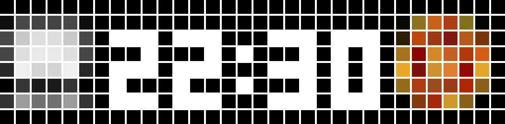
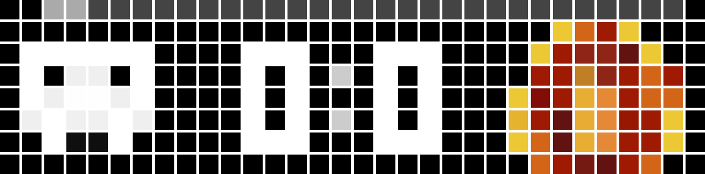
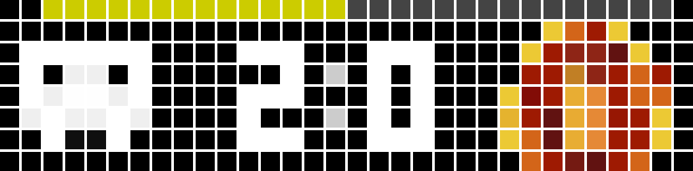
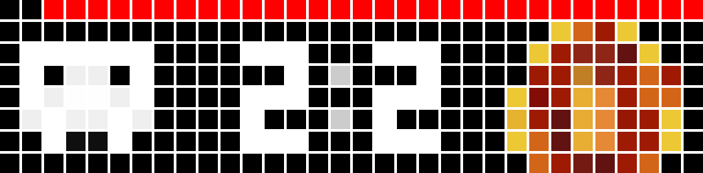
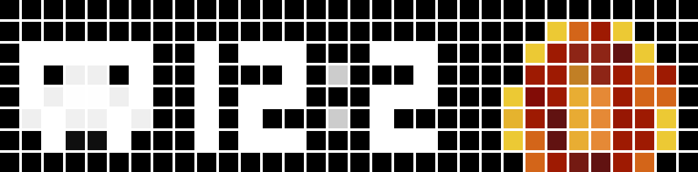

# SoccerUlanzi

A tool that displays live soccer scores on external devices such as the **Ulanzi TC001** or any device with **AwTrix3** installed.

## Configuration

Configure the application by editing the `config.json` file with the following options:

### Basic Configuration

- **TeamIds**: Array of team IDs you want to track. To find team IDs:
  1. Go to ESPN website and search for your team
  2. Select the team from search results
  3. The team ID will be in the URL
  
  Example: For St. Pauli (ID: 270), the URL is:
  `https://www.espn.co.uk/football/club/_/id/270/st-pauli`

- **DeviceIp**: IP address of your Ulanzi display device

- **Uninstall**: Set to `true` to remove all created score apps from the display

- **DisplayDelayOnGames**: Duration (in seconds) the app stays visible on the display during live games

- **DisplayDelayWhenOff**: Duration (in seconds) the app stays visible on the display when no live games are active (default: 7 seconds when display starts for the first time)

- **DelayOnActiveGames**: How frequently game data is updated during active games (format: "HH:MM:SS")

- **DelayWhenIdle**: How frequently game data is updated when no games are active (format: "HH:MM:SS")

### Example Configuration

```json
{
  "TeamIds": ["270", "137", "127"],
  "DeviceIp": "192.168.178.10",
  "Uninstall": false,
  "DisplayDelayOnGames": 40,
  "DisplayDelayWhenOff": 7,
  "DelayOnActiveGames": "00:00:10",
  "DelayWhenIdle": "00:15:00"
}
```

## Advanced Configuration

### League URLs

By default, the application is configured for all supported German soccer leagues from ESPN. You can customize this by modifying the `LeagueUrls` array in the configuration to support any sport available through ESPN's API.

- **LeagueUrls**: Array of ESPN API URLs for different leagues and competitions

To find additional ESPN API URLs for other sports or leagues, visit: https://github.com/pseudo-r/Public-ESPN-API

Example of adding custom league URLs:
```json
{
  "LeagueUrls": [
    "https://site.api.espn.com/apis/site/v2/sports/soccer/ger.1",
    "https://site.api.espn.com/apis/site/v2/sports/soccer/eng.1",
    "https://site.api.espn.com/apis/site/v2/sports/soccer/esp.1"
  ]
}
```

## Team Logos

Team logos are automatically downloaded from ESPN. If you want to use custom logos or if an image is missing, you can place your own logos in the `./cache` directory.

Logo file naming convention:
- `<teamid>.png` - Standard 8x8 logo
- `<teamid>6x6.png` - Smaller 6x6 logo

Example for St. Pauli (Team ID: 270):
- `270.png`
- `2706x6.png`

*Note: The example images below show custom logos - St. Pauli's logo has been replaced with a skull and HSV's logo with the red eye of Sauron.*

## Display Examples

The application shows different displays depending on the game state:

### Pre-Match Display


Displayed 24 hours before a match starts. Shows the game time and team logo.

### Live Match Display


Shown during active games. Features:
- Home team logo (left side)
- Guest team logo (right side)
- Current score (center)
- Progress bar at top indicating minutes played (90-minute scale)

### Match Paused


Same layout as live match, but the progress bar turns yellow when the game is paused.

### Overtime Display


During overtime periods (e.g., cup games), the progress bar becomes red to indicate extended play time (120-minute scale).

### Match Finished


After the final whistle, the progress bar disappears, showing only the final score and team logos.

## Installation & Usage

### Running with Docker

1. **Build the Docker image:**
   ```bash
   docker build -t soccer-ulanzi .
   ```

2. **Run the container:**
   ```bash
   docker run -v $(pwd)/config.json:/app/config.json -v $(pwd)/cache:/app/cache soccer-ulanzi
   ```

   This command:
   - Mounts your local `config.json` file into the container
   - Mounts the local `cache` directory for logo storage
   - Starts the application

3. **Run in the background:**
   ```bash
   docker run -d --name soccer-ulanzi -v $(pwd)/config.json:/app/config.json -v $(pwd)/cache:/app/cache soccer-ulanzi
   ```

### Running with .NET

If you have .NET 9.0 installed locally:

1. **Restore dependencies:**
   ```bash
   dotnet restore
   ```

2. **Run the application:**
   ```bash
   dotnet run
   ```

### Prerequisites

- Ensure your `config.json` file is properly configured with your team IDs and device IP
- Make sure your Ulanzi device is accessible on the network